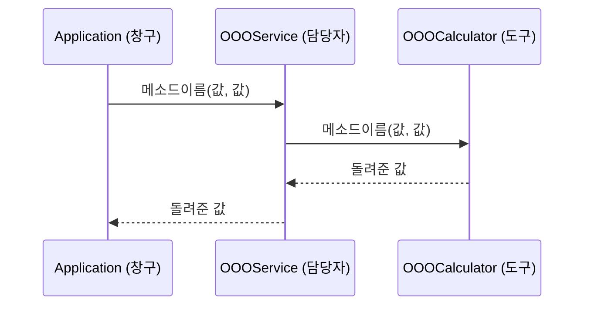

## 기능
(미션의 한 줄 목표를 내 말로)

## 담당
@github아이디

## 내가 만들 클래스와 메소드
(미션 3번 표의 메소드 선언부를 글자 그대로 옮겨 적기)
- (OOOCalculator)
  - (메소드 선언부)
  - (메소드 선언부)
- (OOOService)
  - (메소드 선언부)
  - (메소드 선언부)

## 규칙을 내 말로
- (미션 2번 규칙을 읽고, 어떤 입력에서 어떤 결과가 나오는지 내 말로)

## 호출 흐름도
(미션 4번 호출 흐름을 보고 mermaid 로 직접 그리기)

## 궁금한 점
- (없으면 "없음")
